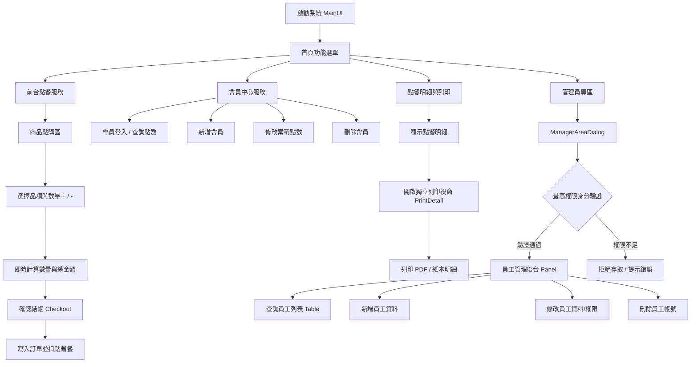
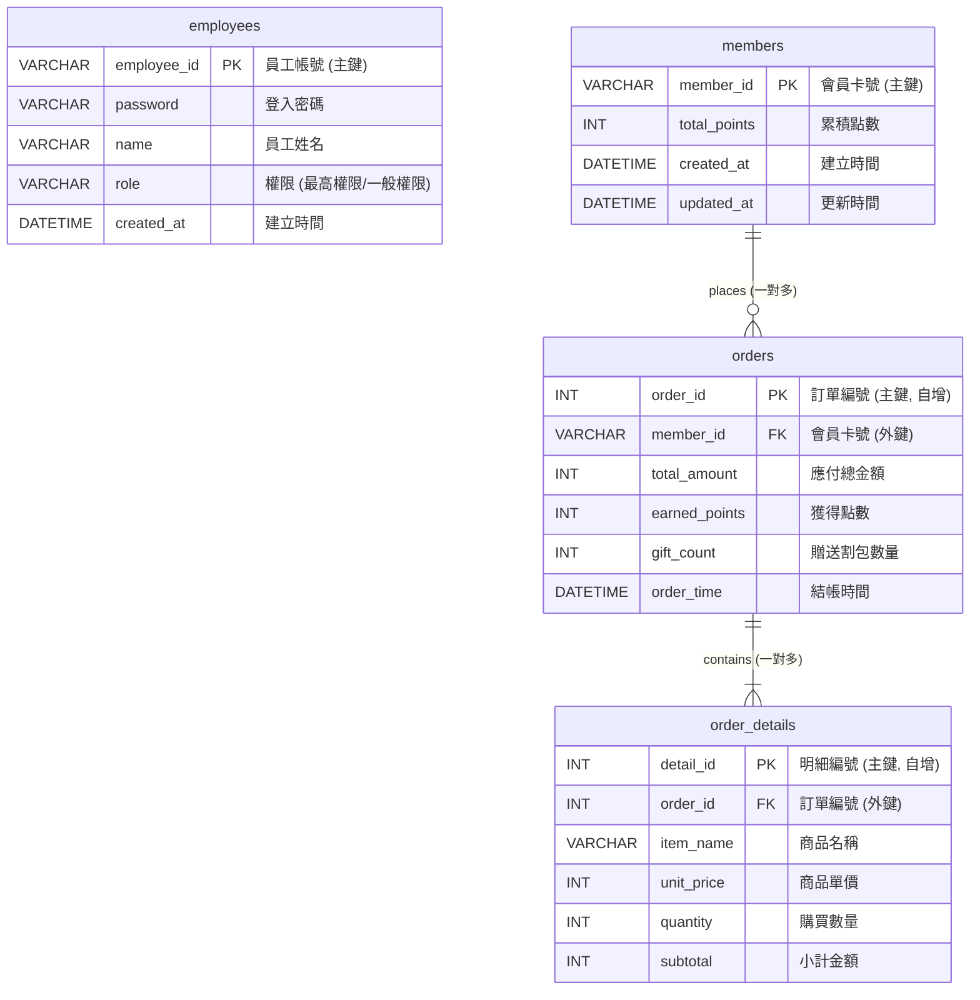

# ★ 好家割包總店 POS 點餐與會員管理系統 ★

本系統為一款融合經典 Swing 視覺風格與現代前後端分離架構的智慧 POS 點餐系統。前端採用 **React (Vite)** 打造，巧妙復刻擬真 Java Swing GUI 介面，並搭配優雅柔和的馬卡龍色調；後端以 **Spring Boot 3** 為核心，整合 **MySQL** 資料庫與 `@Transactional` 事務機制，提供高效率的權限控管、前台點餐結帳、會員積點與自動贈餐等核心業務功能。

---

## ✨ 核心業務功能 (Core System Features)

* **🔐 權限管理與身分驗證 (RBAC)**
  * **角色分權**：精細劃分「最高權限」與「一般權限」。前台開放一般員工操作；後台「員工管理」模組則嚴格限制僅最高權限者可進行 CRUD 維護。
  * **動態選單**：系統依登入者權限，自動切換入口與功能按鈕之開閉狀態。

* **🛒 前台點餐與購物車機制**
  * **靈活點購**：提供 `+` / `-` 快捷按鈕即時調整商品數量。
  * **實時預覽**：購物車自動計算品項小計、商品總件數、應付金額與預計累積點數。
  * **單據列印**：支援開立獨立純文字點餐明細視窗，便於出單與紙本列印。

* **🎁 智控會員與自動贈餐機制**
  * **會員管理**：提供會員卡號之建立、點數查詢、人工校正與帳號註銷。
  * **自動積點**：消費 **滿 100 元即可自動累計 1 點**。
  * **滿額回饋**：系統於結帳時自動判定，**每滿 10 點自動扣抵並免費贈送「綜合割包」1 個**。

* **🗄️ 系統資料整合與安全**
  * **實時時鐘**：畫面上方配置秒級同步系統時鐘，紀錄精確交易時間。
  * **ACID 事務**：使用 `@Transactional` 控制結帳邏輯，確保訂單寫入與點數扣抵無縫同步。

---

## 🛠️ 技術架構與開發環境 (Tech Stack & Environment)

### 💻 開發環境配置

| 領域 | 技術 / 軟體名稱 | 版本規格 |
| :--- | :--- | :--- |
| **前端 (Frontend)** | Node.js / npm | Node `v24.18.0` / npm `11.16.0` |
| | 開發工具 (IDE) | Visual Studio Code `v1.105.0` |
| **後端 (Backend)** | Java Development Kit | JDK `21.0.2` |
| | 整合開發環境 (IDE) | Eclipse IDE for Enterprise Java (`2026-06-R`) |
| | 應用伺服器 / 工具 | Apache Tomcat `10.1.25` / Lombok `v1.18.42` |
| **資料庫 (Database)**| MySQL Community Server | MySQL `8.0.34` (Database: `guabao_db`) |
| **周邊工具** | 版本控制 & API 測試 | GitHub / SourceTree `v3.4.30` / Postman `2025` |

### 🧰 技術領域與應用細節

* **前端技術**：React.js (Component 模組化、Hooks 狀態管理)、JavaScript (ES6+)、Fetch API 非同步溝通、純 CSS 擬真 Swing 介面與 RWD 佈局。
* **後端技術**：Java 21、Spring Boot 3.x (Spring MVC RESTful API、Spring Data JPA、ORM 映射與 `@Transactional` 事務控制)。
* **資料庫技術**：SQL 關聯式資料庫 Schema 設計、DDL/DML 最佳化查詢。

---

## 🖥️ UI 系統功能階層圖 (UI Workflow)


## 🗄️ 資料庫架構 (Database & ER-Model)
### MySQL 連線資訊
* **Service Host**: `localhost:3306`
* **Database Name**: `guabao_db`
* **Username**: `root`
* **Password**: `1234`

### 📊 ER-Model 實體關聯圖程式碼片段

---
## 📡 API 端點路由規範 (API Specification)

### 🔓 系統認證
| Method | API Path | 功能描述 | Request Payload |
| :--- | :--- | :--- | :--- |
| `POST` | `/api/login` | 員工身分登入驗證 | `{ "employee_id": "...", "password": "..." }` |

### 👥 員工管理 (最高權限限定)
| Method | API Path | 功能描述 | Request Payload / Parameter |
| :--- | :--- | :--- | :--- |
| `GET` | `/api/employees` | 取得全體員工清單 | - |
| `POST` | `/api/employees` | 新增員工帳號 | `{ "employeeId": "...", "password": "...", "name": "...", "role": "..." }` |
| `PUT` | `/api/employees/{id}` | 修改指定員工資料 | `{ "password": "...", "name": "...", "role": "..." }` |
| `DELETE` | `/api/employees/{id}` | 註銷指定員工帳號 | - |

### 💳 會員服務
| Method | API Path | 功能描述 | Request Payload / Parameter |
| :--- | :--- | :--- | :--- |
| `GET` | `/api/members/{id}` | 查詢特定會員卡號與點數 | - |
| `POST` | `/api/members` | 建立新會員卡號 | `{ "memberId": "..." }` |
| `PUT` | `/api/members/{id}` | 變更會員累積點數 | `{ "total_points": 10 }` |
| `DELETE` | `/api/members/{id}` | 刪除指定會員卡號 | - |

### 🛒 結帳服務
| Method | API Path | 功能描述 | Request Payload |
| :--- | :--- | :--- | :--- |
| `POST` | `/api/checkout` | 訂單結帳、扣點與贈餐處置 | `{ "memberId": "...", "totalAmount": 470, "items": [...] }` |

---

## 📋 業務基礎資料 (Reference Data)

### 👥 測試帳號彙整
| 帳號 (ID) | 密碼 | 姓名 | 角色權限 | 權限範疇 |
| :--- | :--- | :--- | :--- | :--- |
| **admin** | `1234` | 頭家1 | 最高權限 | 全系統開放 (前台點餐 + 後台員工管理) |
| **E01** | `1234` | 辛勞1 | 一般權限 | 僅開放前台點餐與會員服務 |
| **E02** | `1234` | 辛勞2 | 最高權限 | 全系統開放 (前台點餐 + 後台員工管理) |
| **E03** | `1234` | 辛勞3 | 一般權限 | 僅開放前台點餐與會員服務 |
| **E04** | `1234` | 辛勞4 | 一般權限 | 僅開放前台點餐與會員服務 |

### 🍱 菜單品項與定價
| 品項名稱 | 單價 (NT$) |
| :--- | :---: |
| **綜合割包** | 70 |
| **赤肉割包** | 70 |
| **焢肉割包** | 70 |
| **魚丸湯** | 55 |
| **貢丸湯** | 55 |
| **八寶湯** | 80 |

---

## 🚀 專案部署與啟動指南

### 1. 後端 Spring Boot 服務啟動

1. 確保已部署 JDK 21 與 Maven 環境。
2. 設定 `src/main/resources/application.properties` 之 MySQL 連線參數。
3. 啟動服務（預設埠號：`8080`）：
```Bash
mvn spring-boot:run
```
或直接執行打包完成之系統 Executable JAR：
```Bash
java -jar target/GuaBao40825-0.0.1-SNAPSHOT.jar
```

📝 後端專案結構：
```Plaintext
GuaBao40825/
├── src/
│   └── main/
│       ├── java/
│       │   └── com/example/demo/
│       │       ├── controller/
│       │       │   └── GuaBao4Controller.java       # RESTful API 控制器
│       │       ├── entity/                          # JPA 資料實體與 DTO 模型
│       │       │   ├── CheckoutRequest.java         # 結帳請求 DTO
│       │       │   ├── Employee.java                # 員工 Entity
│       │       │   ├── Member.java                  # 會員 Entity
│       │       │   ├── Order.java                   # 訂單主檔 Entity
│       │       │   ├── OrderDetail.java             # 訂單明細 Entity
│       │       │   └── OrderItem.java               # 購物車品項 DTO
│       │       ├── repository/                      # Spring Data JPA 資料庫存取介面
│       │       │   ├── EmployeeRepository.java
│       │       │   ├── MemberRepository.java
│       │       │   ├── OrderDetailRepository.java
│       │       │   └── OrderRepository.java
│       │       └── GuaBao40825Application.java      # Spring Boot 主程式啟動入口
│       └── resources/
│           ├── static/                              # 前端 React 打包整合靜態資源 (可直接開啟)
│           │   ├── assets/
│           │   │   ├── index-BbHLNo-w.css
│           │   │   └── index-Dp9uQIWs.js
│           │   ├── favicon.svg
│           │   ├── icons.svg
│           │   └── index.html
│           ├── templates/                           # 伺服器端模板目錄 (預留)
│           └── application.properties               # 資料庫連線與系統參數設定檔
├── target/                                          # Maven 打包編譯產出目錄
│   ├── GuaBao40825-0.0.1-SNAPSHOT.jar               # 可獨立執行的 Jar 包 (已內含前端與後端)
│   └── GuaBao40825-0.0.1-SNAPSHOT.jar.original
├── pom.xml                                          # Maven 專案依賴與建置設定檔
└── README.md                                        # 專案說明文件
```
### 2. 前端 React (Vite) 開發環境啟動切換至前端專案目錄：
```Bash
cd react-guabao-1
```
安裝套件依賴：
```Bash
npm install
```
啟動 Vite 開發伺服器（預設埠號：5173）：
```Bash
npm run dev
```
瀏覽器存取 http://localhost:5173 進行前端開發除錯。

📝 前端專案結構：
```Plaintext
react-guabao-1/
├── dist/                          # Vite 打包產出之靜態資源檔 (用於部署至 Spring Boot static)
│   ├── assets/
│   │   ├── index-BbHLNo-w.css
│   │   └── index-Dp9uQIWs.js
│   ├── favicon.svg
│   ├── icons.svg
│   └── index.html
├── node_modules/                  # npm 安裝的第三方套件目錄
├── public/                        # 靜態資源公開目錄
│   ├── favicon.svg
│   └── icons.svg
├── src/                           # React 前端原始碼目錄
│   ├── assets/                    # 前端圖檔與靜態資源
│   │   ├── hero.png
│   │   ├── react.svg
│   │   └── vite.svg
│   ├── App.css                    # GUI 復刻與馬卡龍風格樣式表
│   ├── App.jsx                    # 主介面元件與 React 邏輯
│   ├── index.css                  # 全域基礎樣式表
│   └── main.jsx                   # React 應用程式入口
├── .gitignore                     # Git 版本控制忽略檔案設定
├── .oxlintrc.json                 # Oxlint 程式碼檢查器設定檔
├── index.html                     # SPA 入口 HTML 模板
├── package.json                   # 專案依賴套件與 npm scripts 設定
├── package-lock.json              # 依賴套件版本鎖定檔
├── vite.config.js                 # Vite 開發伺服器與 Proxy 代理設定
└── README.md                      # 專案說明文件
```
